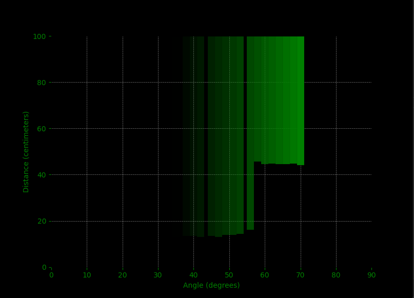
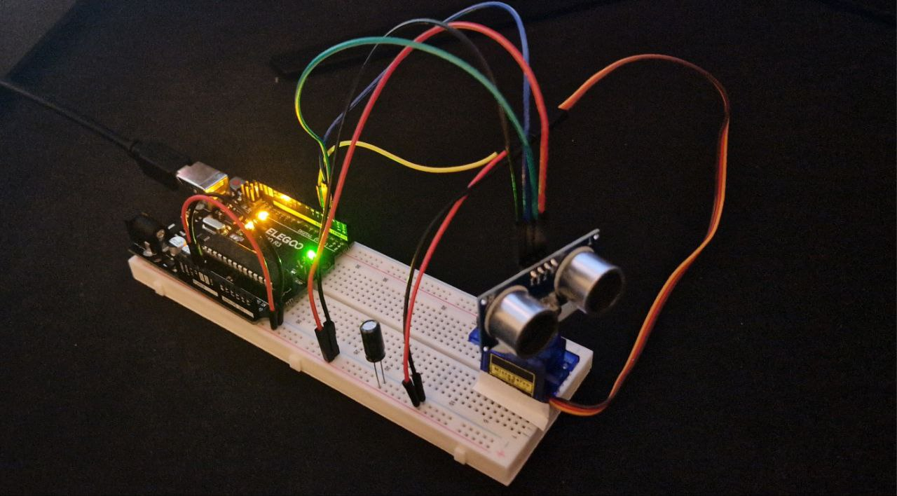

# Arduino sonar
DIY sonar and boresight visualization inspired by [VTOL VR radar](https://vtolvr.wiki.gg/wiki/Electronic_Warfare_%28Mechanic%29#/media/File:Noise.png).

## Dependencies
### Arduino:
- Servo: https://www.arduino.cc/reference/en/libraries/servo

### Python:
- Matplotlib: https://matplotlib.org/
- PySerial: https://pypi.org/project/pyserial/
